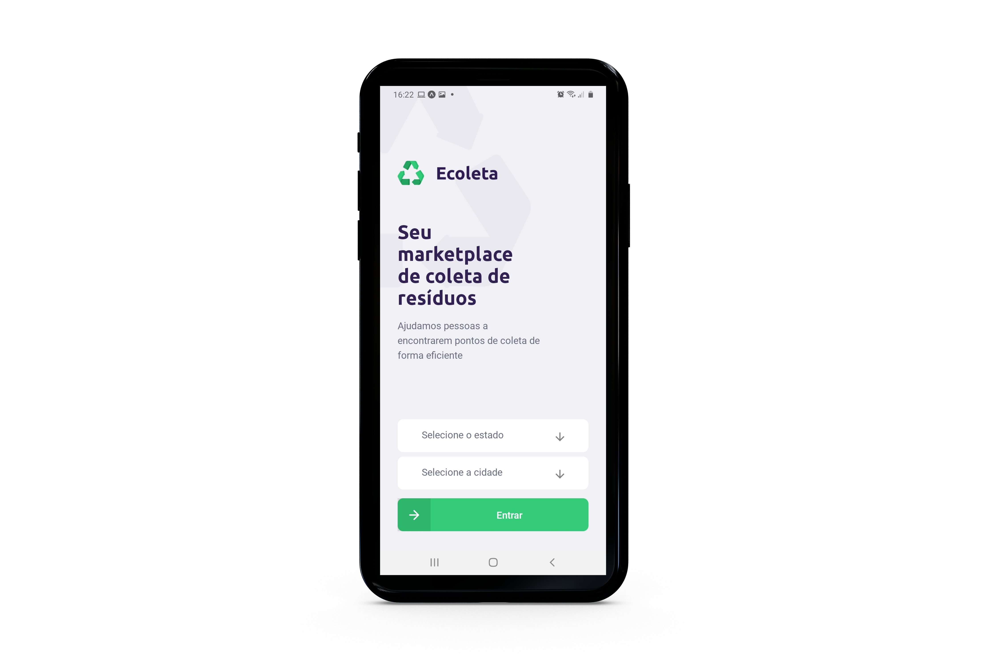

# NLW-01
 Sistema Ecoleta, usado para identificar pontos de coleta de lixo reciclavel 

 
 
 

Esse projeto foi desenvolvido com as seguintes tecnologias:

- [Node.js](https://nodejs.org/en/)
- [React](https://pt-br.reactjs.org/)
- [React Native](https://reactnative.dev/)

